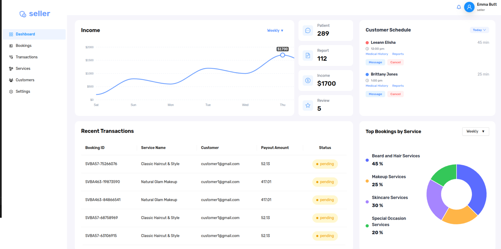

# StyleVibe – Salon & Beauty Service Booking Platform

StyleVibe is a **full-stack web application** that connects customers with beauty professionals. It offers a seamless experience for booking salon services, managing shops, handling payments, and real-time communication.

🌐 **Live Demo**: https://stylevibe-app.vercel.app/
🎥 **Demo Video**: [Add Loom/YouTube link here]  

---

## ✨ Key Features

### 👩‍💻 For Customers
- Book salon & beauty services easily  
- Secure Stripe-powered payments  
- Real-time chat with service providers  
- Booking management, reviews & notifications  

### 💼 For Service Providers
- Create & manage shops and service catalogs  
- Configure available time slots & off-days  
- Booking dashboard & customer chat  
- Revenue tracking & Stripe payouts  

### 🛠️ For Admins
- Manage users, shops, and services  
- Platform analytics dashboard  
- Transaction monitoring & content management  

---

## ⚙️ Tech Highlights
- **Frontend**: Next.js 14, React 18, Redux Toolkit, TailwindCSS, Ant Design  
- **Backend**: Node.js (Express), MongoDB (Mongoose), Redis (BullMQ), Socket.IO  
- **Payments**: Stripe Connect integration  
- **Infrastructure**: Docker, Cloudinary, Nodemailer, Zod validation  

---

## 📸 Screenshots

### Authentication
<table>
  <tr>
    <td></td>
  </tr>
</table>

### Services by Seller
<table>
  <tr>
    <td></td>
     <td></td>
  </tr>
</table>

### Connect stripe account
<table>
  <tr>
    <td></td>
    <td></td>
    <td></td>
  </tr>
  </tr>
</table>

### Customer Booking
<table>
  <tr>
    <td></td>
    <td></td>
    <td></td>
  </tr>
  </tr>
</table>

### Seller bookings table
<table>
  <tr>
    <td></td>
  </tr>
  </tr>
</table>

### Real time Chat with Customer with Real time notifications
<table>
  <tr>
    <td></td>
    <td></td>
  </tr>
  </tr>
</table>

### Customers transaction record
<table>
  <tr>
    <td></td>
  </tr>
  </tr>
</table>

### Dashboard
<table>
  <tr>
    <td></td>
  </tr>
</table>

---

## 🚀 Deployment
- Containerized with Docker & Docker Compose  
- MongoDB & Redis support  
- Production-ready setup  

---

## 👥 User Roles
- **Customer** – Book services, chat, manage bookings  
- **Seller** – Manage shop, services, and earnings  
- **Admin** – Platform management  
- **Super Admin** – Full access & configuration  

---

## 📄 License
This is a **showcase repository** for demonstration purposes. The source code is private.  
